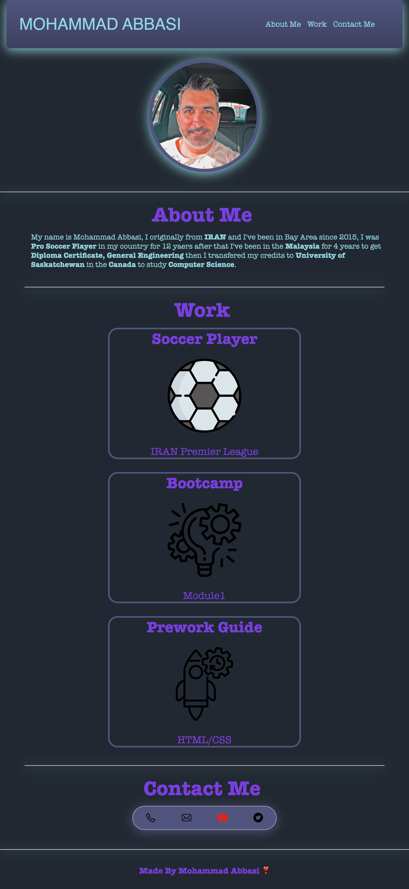

# module-02
Module-02 Challenge

## My Portfolio

Provide a short description explaining the what, why, and how of your project. Use the following questions as a guide:

I am being motivated for doing this project because this project shows a little bit about my background just I learned how can I linke the elements how should I use the advance CSS elements and how make a responsive web pages.

## Table of Contents (Optional)

The License of this project is MIT License.

## Installation

Just we should copy ssh address and in specific folder use terminal or gitBash git clone command to install the file in your computer after that use code editor to see my page

## Usage

    

## License

MIT License.

